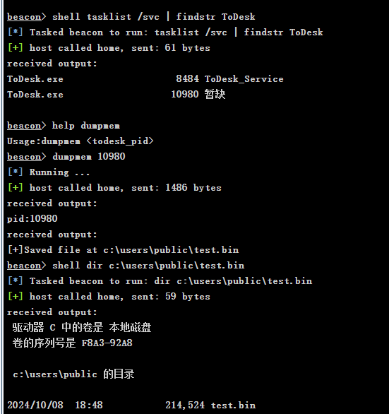
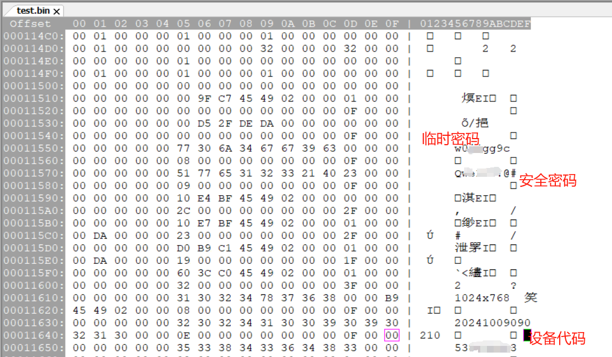

<h1>DumpTodesk_BOF</h1>

一个用于Dump特定进程内存的BOF，主要用来dump todesk进程然后找密码.

<h2>示例:</h2>
官网最新版todesk 4.7.4.8  

  

之后正常下载test.bin后查找设备代码，临时密码等,实战截图:  

  
<h2>参考</h2>
https://github.com/yangliukk/FindToDeskPass

